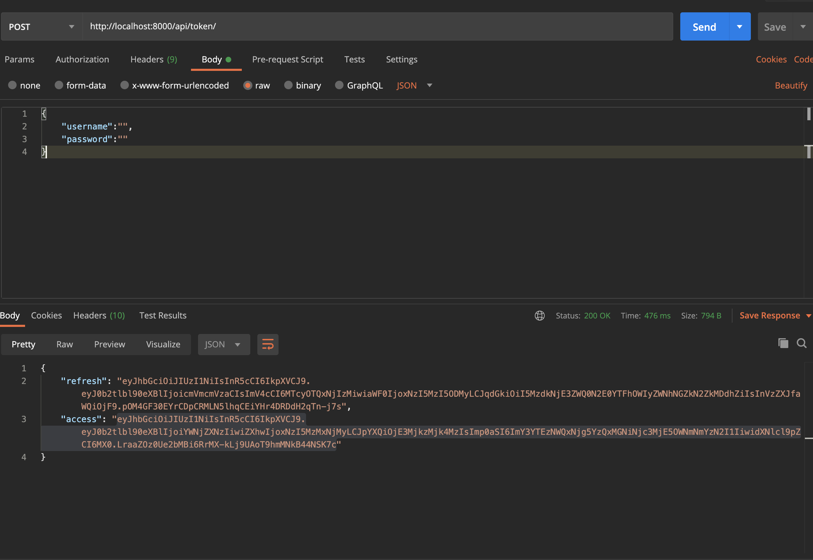
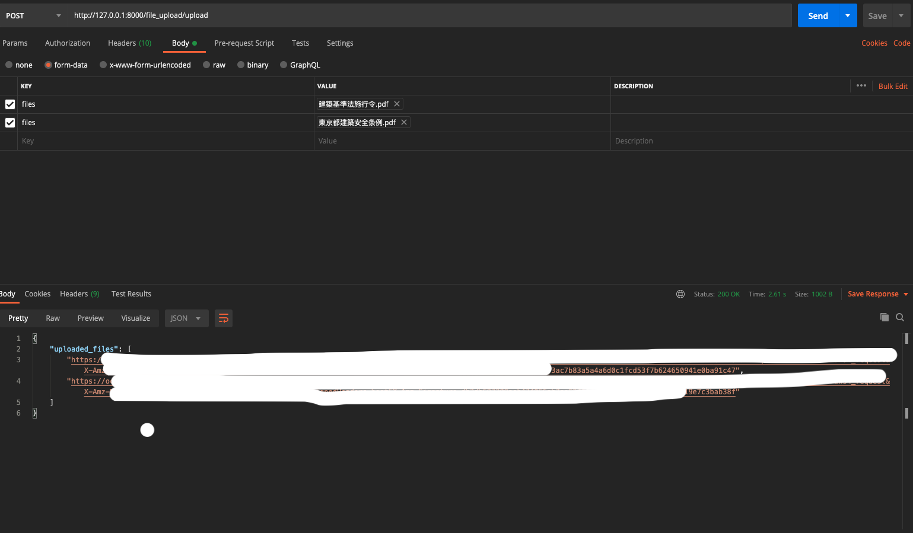
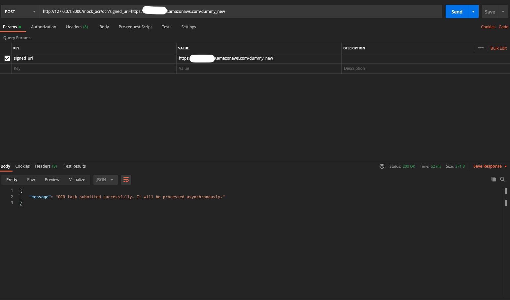
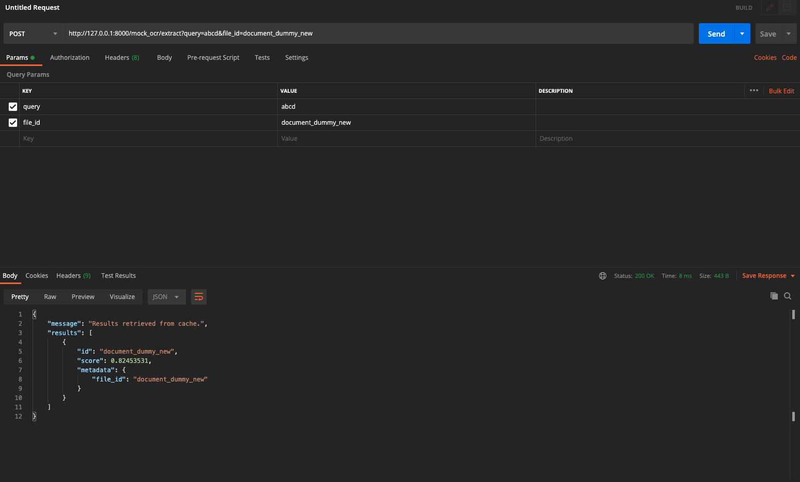

# Mock OCR APIs

This repository contains a set of APIs which mocks the OCR (Optical Character Recognition) process on documents, performs vector search, and managing file uploads. The APIs are built using Django-ninja, Celery, Redis, and integrated with OpenAI for text embeddings, and Pinecone for vector-based searches and storage.

## Token Generation Endpoint:

This API will take the username and password of your Django app's defined users and return you the access and refresh token.

```
curl --location --request POST 'http://localhost:8000/api/token/' \
--header 'Content-Type: application/json' \
--data-raw '{
    "username":"YOUR USERNAME",
    "password":"YOUR PASSWORD"
}'
```
### Demo Image1:


## File Upload Endpoint:

This API will take any number of files with the file types `["pdf", "tiff", "png", "jpeg", "jpg"]`, upload them to your S3 bucket, and return an array of signed URLs for those files.
```
curl --location --request POST 'http://127.0.0.1:8000/file_upload/upload' \
--header 'Content-Type: multipart/form-data' \
--header 'Authorization: Bearer YOUR ACCESS TOKEN' \
--form 'files=@"YOUR FILE PATH"'
```

### Demo Image2:


## Mock OCR Endpoint:

This API will simulate running an OCR service on a file for an arbitrary given signed URL, process OCR results with OpenAI's embedding model(text-embedding-ada-002) then upload the embeddings to a
Pinecone vector database for future searches. OCR process is processed by using asynchronous processing via CELERY. **I haven't used an actual signed URL since this is just for mocking OCR, I have made custom URL so that my code can get the file name of already created OCR JSON from a sample_ocr directory**

```
curl --location --request POST 'http://127.0.0.1:8000/mock_ocr/ocr?signed_url=https://YOUR_BUCKET_NAME.s3.amazonaws.com/dummy_new' \
--header 'Authorization: Bearer YOUR TOKEN' \
--data-raw ''
```
### Demo Image3:


## Attribute extraction Endpoint:

This API will take a query text and file_id as input, perform a vector search, and returns matching attributes based on the embeddings. The vector search will help identify the relevant part(s) of the file. Caching is implemented for frequent queries to improve performance.

```
curl --location --request POST 'http://127.0.0.1:8000/mock_ocr/extract?query=abcd&file_id=document_dummy_new' \
--header 'Authorization: Bearer YOUR_TOKEN'
```
### Demo Image4:



 
