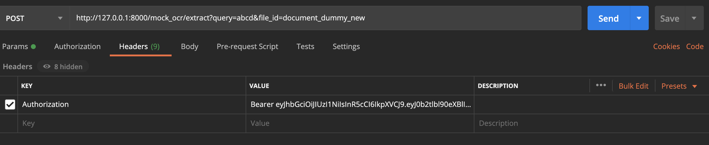

# Mock OCR APIs

This repository contains a set of APIs which mocks the OCR (Optical Character Recognition) process on documents, performs vector search, and manage file uploads. These APIs are built using Django-ninja, Celery, Redis, and integrated with OpenAI for text embeddings, and Pinecone for vector-based searches and storage and AWS S3 for file storage.

## Token Generation Endpoint:

This API will take the username and password of your Django app's defined users and return you the access and refresh token. After running `python manage.py migrate`, you can create a superuser for your app by running the command `python manage.py createsuperuser` and you can manage your app's users via the Django admin portal at `http://localhost:8000/admin/`.

```
curl --location --request POST 'http://localhost:8000/api/token/' \
--header 'Content-Type: application/json' \
--data-raw '{
    "username":"YOUR USERNAME",
    "password":"YOUR PASSWORD"
}'
```
### Demo Image1:

### Example image on how to use the token:


## File Upload Endpoint:

This API will take any number of files with the file types `["pdf", "tiff", "png", "jpeg", "jpg"]`, upload them to your S3 bucket, and return an array of signed URLs for those files.
```
curl --location --request POST 'http://127.0.0.1:8000/file_upload/upload' \
--header 'Content-Type: multipart/form-data' \
--header 'Authorization: Bearer YOUR ACCESS TOKEN' \
--form 'files=@"YOUR FILE PATH"'
```

### Demo Image2:


## Mock OCR Endpoint:

This API will simulate running an OCR service on a file for an arbitrary given signed URL, process OCR results with OpenAI's embedding model(text-embedding-ada-002) then upload the embeddings to a
Pinecone vector database for future searches. OCR process is processed by using asynchronous processing via CELERY. **I haven't used an actual signed URL since this is just for mocking OCR, I have made custom URL so that my code can get the file name of already created OCR JSON from a sample_ocr directory**

```
curl --location --request POST 'http://127.0.0.1:8000/mock_ocr/ocr?signed_url=https://YOUR_BUCKET_NAME.s3.amazonaws.com/dummy_new' \
--header 'Authorization: Bearer YOUR TOKEN' \
--data-raw ''
```
### Demo Image3:


## Attribute extraction Endpoint:

This API will take a query text and file_id as input, perform a vector search, and returns matching attributes based on the embeddings. The vector search will help identify the relevant part(s) of the file. Caching is implemented for frequent queries to improve performance.

```
curl --location --request POST 'http://127.0.0.1:8000/mock_ocr/extract?query=abcd&file_id=document_dummy_new' \
--header 'Authorization: Bearer YOUR_TOKEN'
```
### Demo Image4:


# Steps to start the docker container(macOS):

## Installing Docker and Docker Compose on macOS

## Prerequisites

- Create a file named `.env` in the root directory. Copy all the required environment variables from `sample_env` then paste them in .env and fill in their values.
- For other operating systems install docker and docker-compose

## Installing Docker Desktop on macOS

1. **Download Docker Desktop:**

   Visit the [Docker Desktop for Mac](https://www.docker.com/products/docker-desktop/) page and download the latest version.

2. **Install Docker Desktop:**

   - Open the downloaded `.dmg` file.
   - Drag and drop Docker into the Applications folder.
   - Launch Docker from the Applications folder.

3. **Follow the Setup Wizard:**

   - After launching Docker, follow the instructions in the setup wizard to complete the installation.

4. **Verify Docker Installation:**

   Open a terminal and run the following command to check if Docker is installed successfully:

   ```
   docker --version
   ```
   Docker Compose is included with Docker Desktop for Mac. You can verify it by running:
   ```
   docker-compose --version
   ```
   Change to the directory containing your Django project and docker-compose.yml file:
   ```
   docker-compose up --build
   ```
   To stop the running Docker containers, you can either press CTRL + C in the terminal where the containers are running, or you can run:
   ```
   docker-compose down
   ```


 
